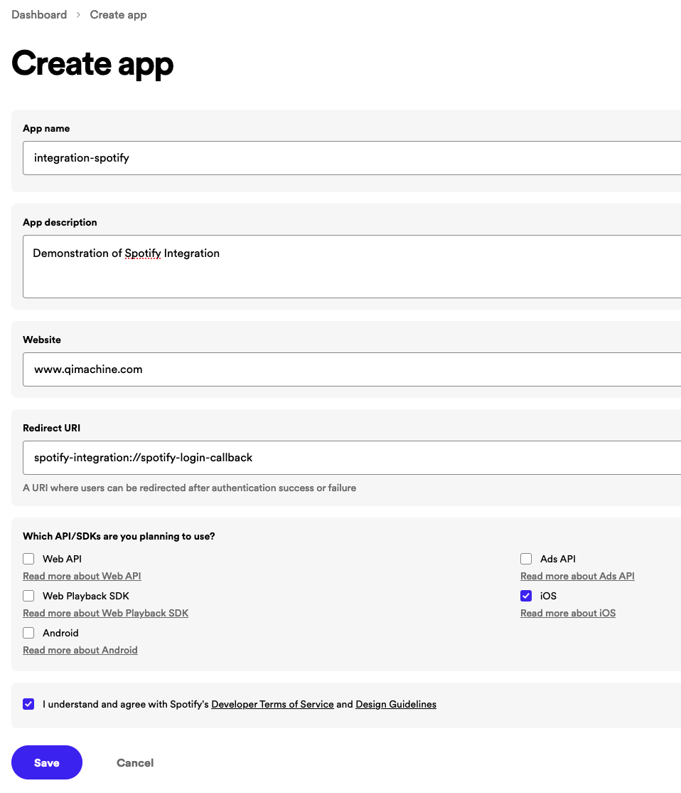
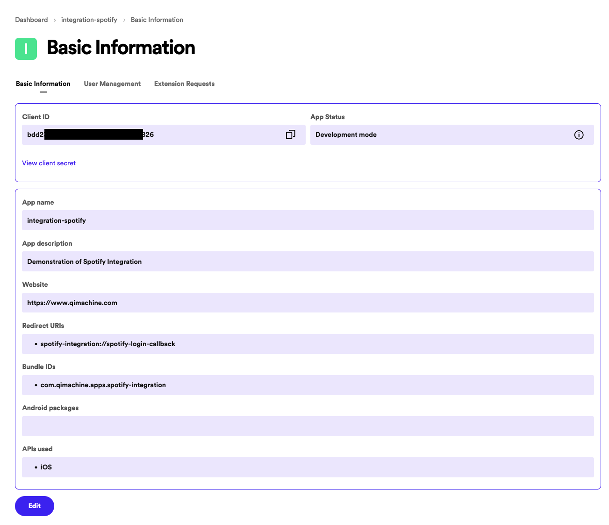
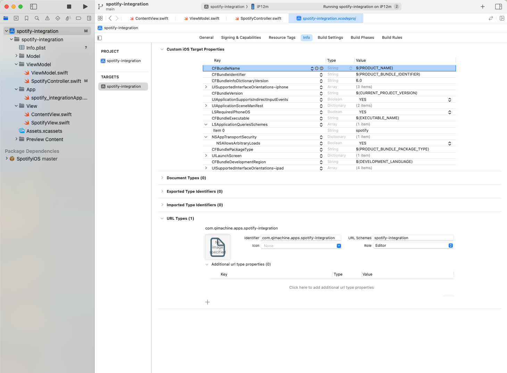

# Spotify Integration for iOS (SwiftUI)

# Overview
An iOS application built with SwiftUI for iOS 16.4+ that integrates Spotify to allow users to connect to the Spotify app installed on their device, authorize, play, and pause a track directly from within the app.

## Features
 - Connect to the Spotify app
 - Authorize and authenticate with Spotify
 - Play and pause a specific track

### Get Started

 - Xcode 13 or later
 - An iOS device iOS 16.4 or later
 - Spotify app installed on the device
 - Spotify Developer Account Setup

#### Install Spotify iOS package
In XCode > File > Add Package Dependencies... > in the search box on the top-right, enter: `https://github.com/spotify/ios-sdk.git`
When the Spotify iOS SDK appears, click Add Package, and follow the steps to add.

#### Spotify Developer Setup
You need to register for a Spotify Developer account register your app. Go here: `https://developer.spotify.com/dashboard`

Follow these steps:
 - Create App
 - Enter your app Name, description, website
 - Redirect URI: this must match what you put in the query URL (see below); e.g. `myapp.myorganization.apps.spotify-integration`
 - Select `iOS` (and any other platforms you intend to use)
 - Accept Terms of Service
 - Save
 - When the app dashboard appears, copy the `Client ID` and paste it in `spotifyClientID` in `SpotifyController.swift`.
 - Copy your `RedirectURI` and paste it in `spotifyRedirectURL` in `SpotifyController.swift`.
 - Click Edit and add your bundle identifier to the iOS Bundle IDs and click Add.

#### Permissions/Information Property List

To check if Spotify is installed, and to launch the Spotify app, you need permission. In XCode > Click <project name> at the top of the Project Navigator (left panel) > Click <project name> under Targets > Click "Info" tab > Under "Custom iOS Target Properties", right-click and choose "Raw Keys and Values". Hover mouse on a row item and click the (+) icon > In the new row, type: `LSApplicationQueriesSchemes` > Hit Enter. Click the small arrow to expand the array. In the Value column for Item 0, enter `spotify`.

To enable music streaming/ you also need to: 
In a new row, type: `NSAppTransportSecurity` > Hit Enter. Click the small arrow to expand the array. Click to (+) icon to add a row (inside the Dictionary) > In the dropdown, choose `NSAllowsArbitaryLoads`. In the Value column, use the dropdown to change to `YES`. 

##### QUERY URL
You also need to add a query URL representing your app to the iOS system. This registers `myapp://` to the system so other apps (i.e. Spotify) can re-open your app. In the same "Info" tab as above, expand "URL Types" at the bottom. Add a new entry.
 - Identifer: your app bundle identifier (you can copy this from the Signing & Capabilites tab)
 - URL Schemes: `myapp`
 - Icon: [blank]
 - Role: [Editor] (doesn't matter for this purpose)

Now, when Spotify calls `myapp://spotify-login-callback`, it will open your app.

### Installation
Clone this repository and open the project in Xcode. Run the project on your iOS device (does not work in Simulator because Spotify cannot be installed).

### Usage

The app provides a simple UI with two buttons: one to connect and play a track and another to pause the playing track.

 - Tap on `connectAndPlay()` to start playing a track. You might need to authorize the app on the first run.
 - Tap on `pauseTrack()` to pause the playing track.

### How It Works

The SpotifyController class handles the integration with Spotify using the SpotifyiOS SDK. It manages the connection, authorization, and playback controls. The SpotifyView presents the UI and interacts with the SpotifyController to control playback.

### License

This project is licensed under the MIT License.

